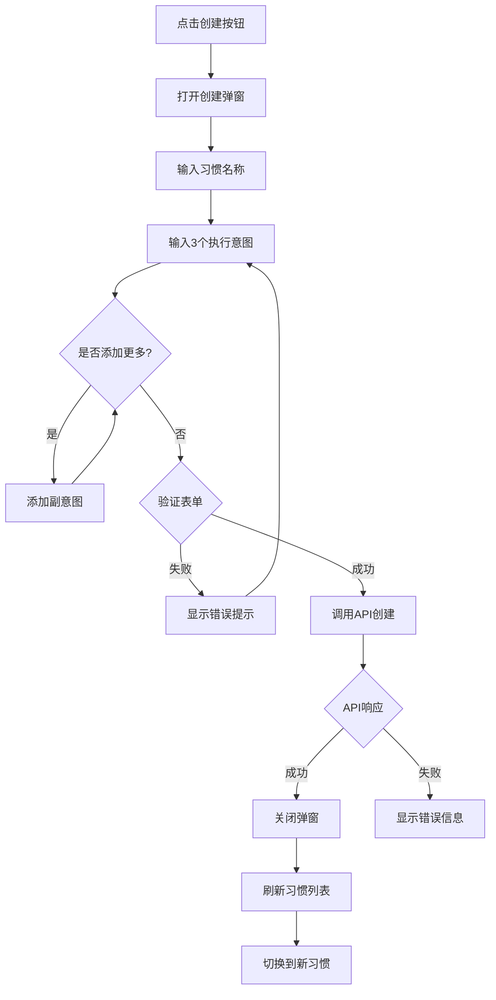
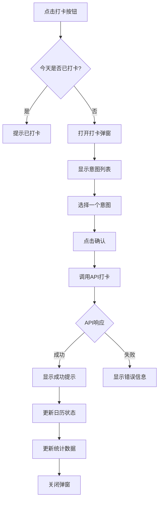
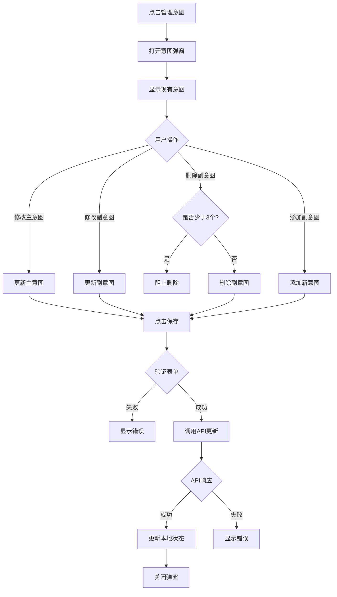

# 100天配额法 - 前端需求文档 (FRD)

> **版本**: v1.0  
> **技术栈**: Next.js 14+ (App Router) + Tailwind CSS + TypeScript  
> **后端 API**: FastAPI  
> **参考**: cli_main.py + UI 设计图

---

## 📋 目录

1. [项目概述](#项目概述)
2. [页面结构](#页面结构)
3. [组件设计](#组件设计)
4. [交互逻辑](#交互逻辑)
5. [状态管理](#状态管理)
6. [数据流](#数据流)
7. [技术实现细节](#技术实现细节)

---

## 1. 项目概述

### 1.1 核心理念
- **非连续打卡**：100天配额，不要求连续
- **执行意图**：IF-THEN 情境绑定
- **可视化日历**：直观展示打卡记录

### 1.2 核心功能
- ✅ 创建习惯（最多4个）
- ✅ 每日打卡（选择执行意图）
- ✅ 日历视图（月度展示）
- ✅ 执行意图管理
- ✅ 进度统计

---

## 2. 页面结构

### 2.1 页面架构

```
App
├── MainPage (主页面) - nian100.png
│   ├── Header (顶部导航)
│   ├── HabitTabs (习惯切换)
│   ├── Calendar (日历组件)
│   ├── Stats (统计信息)
│   └── ActionButtons (操作按钮)
│
├── CreateHabitModal (创建习惯弹窗) - moban.png
├── CheckinModal (打卡弹窗) - daka.png
├── IntentModal (执行意图弹窗) - zhixingyitu.png
└── DateDetailModal (日期详情弹窗)
    ├── CheckedDateView (已打卡) - yidaka.png
    ├── UncheckedDateView (未打卡) - weidaka.png
    └── FutureDateView (不能打卡) - bunengdaka.png
```

### 2.2 页面清单

| 页面/组件 | UI 设计图 | 路由 | 说明 |
|----------|----------|------|------|
| 主页面 | `nian100.png` | `/` | 日历视图+统计信息 |
| 创建习惯弹窗 | `moban.png` | Modal | 创建新习惯表单 |
| 打卡弹窗 | `daka.png` | Modal | 选择执行意图打卡 |
| 已打卡详情 | `yidaka.png` | Modal | 显示打卡记录 |
| 未打卡详情 | `weidaka.png` | Modal | 显示未完成状态 |
| 不能打卡提示 | `bunengdaka.png` | Modal | 未来日期提示 |
| 执行意图管理 | `zhixingyitu.png` | Modal | 管理执行意图 |

---

## 3. 组件设计

### 3.1 主页面布局

```tsx
// app/page.tsx
export default function MainPage() {
  return (
    <div className="min-h-screen bg-gray-50">
      {/* 头部 */}
      <Header />
      
      {/* 主内容区 */}
      <main className="container mx-auto px-4 py-6">
        <div className="grid grid-cols-1 lg:grid-cols-3 gap-6">
          
          {/* 左侧：日历区域 */}
          <div className="lg:col-span-2">
            <Calendar 
              taskId={currentTaskId}
              onDateClick={handleDateClick}
            />
          </div>
          
          {/* 右侧：信息和操作区 */}
          <div className="space-y-4">
            {/* 习惯切换 Tab */}
            <HabitTabs 
              tasks={tasks}
              currentTaskId={currentTaskId}
              onChange={setCurrentTaskId}
            />
            
            {/* 统计信息 */}
            <StatsCard task={currentTask} />
            
            {/* 操作按钮 */}
            <ActionButtons
              onCheckin={openCheckinModal}
              onCreate={openCreateModal}
              onManageIntents={openIntentModal}
            />
          </div>
        </div>
      </main>
    </div>
  );
}
```

---

### 3.2 核心组件详细设计

#### 3.2.1 Calendar 组件 (日历)

**设计参考**: `nian100.png`

```tsx
// components/Calendar.tsx
interface CalendarProps {
  taskId: string;
  onDateClick: (date: Date, status: DateStatus) => void;
}

type DateStatus = 'checked' | 'unchecked' | 'future' | 'disabled';

export function Calendar({ taskId, onDateClick }: CalendarProps) {
  return (
    <div className="bg-white rounded-lg shadow-md p-6">
      {/* 月份导航 */}
      <div className="flex items-center justify-between mb-4">
        <button onClick={prevMonth}>
          <ChevronLeft className="w-6 h-6" />
        </button>
        <h2 className="text-xl font-bold">{currentMonth}</h2>
        <button onClick={nextMonth}>
          <ChevronRight className="w-6 h-6" />
        </button>
      </div>
      
      {/* 星期标题 */}
      <div className="grid grid-cols-7 gap-2 mb-2">
        {weekDays.map(day => (
          <div key={day} className="text-center text-gray-500 font-medium">
            {day}
          </div>
        ))}
      </div>
      
      {/* 日期网格 */}
      <div className="grid grid-cols-7 gap-2">
        {dates.map(date => (
          <DateCell
            key={date.toString()}
            date={date}
            status={getDateStatus(date)}
            onClick={() => onDateClick(date, getDateStatus(date))}
          />
        ))}
      </div>
      
      {/* 图例 */}
      <div className="mt-4 flex items-center gap-4 text-sm text-gray-600">
        <span>✅ 已打卡</span>
        <span>📍 今天</span>
        <span>⚪ 未打卡</span>
      </div>
    </div>
  );
}
```

**日期单元格状态**:
```tsx
// components/DateCell.tsx
function DateCell({ date, status, onClick }) {
  const styles = {
    checked: 'bg-green-500 text-white hover:bg-green-600',
    unchecked: 'bg-gray-200 text-gray-700 hover:bg-gray-300',
    future: 'bg-gray-100 text-gray-400 cursor-not-allowed',
    disabled: 'bg-gray-50 text-gray-300 cursor-not-allowed',
    today: 'ring-2 ring-blue-500'
  };
  
  return (
    <button
      onClick={onClick}
      disabled={status === 'future' || status === 'disabled'}
      className={`
        aspect-square rounded-lg flex items-center justify-center
        transition-all font-medium
        ${styles[status]}
        ${isToday && styles.today}
      `}
    >
      {date.getDate()}
    </button>
  );
}
```

---

#### 3.2.2 HabitTabs 组件 (习惯切换)

```tsx
// components/HabitTabs.tsx
interface HabitTabsProps {
  tasks: Task[];
  currentTaskId: string;
  onChange: (taskId: string) => void;
}

export function HabitTabs({ tasks, currentTaskId, onChange }: HabitTabsProps) {
  return (
    <div className="bg-white rounded-lg shadow-md p-4">
      <div className="flex flex-col gap-2">
        {tasks.map(task => (
          <button
            key={task.id}
            onClick={() => onChange(task.id)}
            className={`
              px-4 py-3 rounded-lg text-left transition-all
              ${task.id === currentTaskId 
                ? 'bg-blue-500 text-white shadow-md' 
                : 'bg-gray-100 text-gray-700 hover:bg-gray-200'}
            `}
          >
            <div className="font-medium">{task.name}</div>
            <div className="text-sm opacity-80">
              {task.logs.length}/{task.target_days} 天
            </div>
          </button>
        ))}
        
        {/* 添加新习惯按钮（最多4个）*/}
        {tasks.length < 4 && (
          <button
            onClick={onCreateNew}
            className="px-4 py-3 rounded-lg border-2 border-dashed border-gray-300 text-gray-500 hover:border-blue-500 hover:text-blue-500"
          >
            + 创建新习惯
          </button>
        )}
      </div>
    </div>
  );
}
```

---

#### 3.2.3 StatsCard 组件 (统计卡片)

```tsx
// components/StatsCard.tsx
export function StatsCard({ task }: { task: Task }) {
  const progress = (task.logs.length / task.target_days) * 100;
  const remaining = task.target_days - task.logs.length;
  
  return (
    <div className="bg-white rounded-lg shadow-md p-6">
      <h3 className="text-lg font-bold mb-4">{task.name}</h3>
      
      {/* 进度条 */}
      <div className="mb-4">
        <div className="flex justify-between text-sm mb-2">
          <span>进度</span>
          <span className="font-medium">{progress.toFixed(1)}%</span>
        </div>
        <div className="h-2 bg-gray-200 rounded-full overflow-hidden">
          <div 
            className="h-full bg-blue-500 transition-all"
            style={{ width: `${progress}%` }}
          />
        </div>
      </div>
      
      {/* 统计数据 */}
      <div className="grid grid-cols-2 gap-4">
        <div className="text-center p-3 bg-green-50 rounded-lg">
          <div className="text-2xl font-bold text-green-600">
            {task.logs.length}
          </div>
          <div className="text-sm text-gray-600">已完成</div>
        </div>
        <div className="text-center p-3 bg-blue-50 rounded-lg">
          <div className="text-2xl font-bold text-blue-600">
            {remaining}
          </div>
          <div className="text-sm text-gray-600">剩余</div>
        </div>
      </div>
    </div>
  );
}
```

---

#### 3.2.4 CreateHabitModal 组件 (创建习惯弹窗)

**设计参考**: `moban.png`

```tsx
// components/CreateHabitModal.tsx
export function CreateHabitModal({ isOpen, onClose, onSubmit }) {
  const [name, setName] = useState('');
  const [intents, setIntents] = useState([
    { if: '', then: '' },
    { if: '', then: '' },
    { if: '', then: '' }
  ]);
  
  return (
    <Modal isOpen={isOpen} onClose={onClose}>
      <div className="bg-white rounded-lg p-6 max-w-2xl w-full">
        <h2 className="text-2xl font-bold mb-6">创建新习惯</h2>
        
        {/* 习惯名称 */}
        <div className="mb-6">
          <label className="block text-sm font-medium mb-2">
            习惯名称 <span className="text-red-500">*</span>
          </label>
          <input
            type="text"
            value={name}
            onChange={(e) => setName(e.target.value)}
            placeholder="例如：运动、阅读、控糖"
            className="w-full px-4 py-2 border border-gray-300 rounded-lg focus:ring-2 focus:ring-blue-500"
          />
        </div>
        
        {/* 执行意图列表 */}
        <div className="mb-6">
          <label className="block text-sm font-medium mb-2">
            执行意图 <span className="text-red-500">*至少3个</span>
          </label>
          
          {intents.map((intent, index) => (
            <div key={index} className="mb-4 p-4 bg-gray-50 rounded-lg">
              <div className="flex items-center justify-between mb-2">
                <span className="font-medium">意图 {index + 1}</span>
                {index >= 3 && (
                  <button
                    onClick={() => removeIntent(index)}
                    className="text-red-500 hover:text-red-700"
                  >
                    删除
                  </button>
                )}
              </div>
              
              <div className="space-y-2">
                <input
                  type="text"
                  value={intent.if}
                  onChange={(e) => updateIntent(index, 'if', e.target.value)}
                  placeholder="如果：早上7:00闹钟响"
                  className="w-full px-3 py-2 border border-gray-300 rounded"
                />
                <input
                  type="text"
                  value={intent.then}
                  onChange={(e) => updateIntent(index, 'then', e.target.value)}
                  placeholder="那么：立刻下楼快走20分钟"
                  className="w-full px-3 py-2 border border-gray-300 rounded"
                />
              </div>
            </div>
          ))}
          
          {/* 添加更多意图 */}
          <button
            onClick={addIntent}
            className="w-full py-2 border-2 border-dashed border-gray-300 rounded-lg text-gray-600 hover:border-blue-500 hover:text-blue-500"
          >
            + 添加更多意图
          </button>
        </div>
        
        {/* 提交按钮 */}
        <div className="flex gap-3">
          <button
            onClick={onClose}
            className="flex-1 px-4 py-2 border border-gray-300 rounded-lg hover:bg-gray-50"
          >
            取消
          </button>
          <button
            onClick={handleSubmit}
            disabled={!isValid}
            className="flex-1 px-4 py-2 bg-blue-500 text-white rounded-lg hover:bg-blue-600 disabled:opacity-50"
          >
            创建习惯
          </button>
        </div>
      </div>
    </Modal>
  );
}
```

---

#### 3.2.5 CheckinModal 组件 (打卡弹窗)

**设计参考**: `daka.png`

```tsx
// components/CheckinModal.tsx
export function CheckinModal({ isOpen, onClose, task, onCheckin }) {
  const [selectedIntent, setSelectedIntent] = useState<number | null>(null);
  
  return (
    <Modal isOpen={isOpen} onClose={onClose}>
      <div className="bg-white rounded-lg p-6 max-w-md w-full">
        <h2 className="text-2xl font-bold mb-4">今天的打卡</h2>
        <p className="text-gray-600 mb-6">
          请选择你今天执行的意图：
        </p>
        
        {/* 意图选择列表 */}
        <div className="space-y-3 mb-6">
          {task.intents.map((intent, index) => (
            <label
              key={index}
              className={`
                block p-4 border-2 rounded-lg cursor-pointer transition-all
                ${selectedIntent === index 
                  ? 'border-blue-500 bg-blue-50' 
                  : 'border-gray-200 hover:border-gray-300'}
              `}
            >
              <input
                type="radio"
                name="intent"
                checked={selectedIntent === index}
                onChange={() => setSelectedIntent(index)}
                className="mr-3"
              />
              <div className="inline">
                <span className="font-medium">如果</span>
                <span className="mx-1">{intent.if}</span>
                <br />
                <span className="font-medium">那么</span>
                <span className="mx-1">{intent.then}</span>
                <span className="text-sm text-gray-500 ml-2">
                  (已用 {intent.count} 次)
                </span>
              </div>
            </label>
          ))}
        </div>
        
        {/* 操作按钮 */}
        <div className="flex gap-3">
          <button
            onClick={onClose}
            className="flex-1 px-4 py-2 border border-gray-300 rounded-lg hover:bg-gray-50"
          >
            取消
          </button>
          <button
            onClick={() => onCheckin(selectedIntent)}
            disabled={selectedIntent === null}
            className="flex-1 px-4 py-2 bg-blue-500 text-white rounded-lg hover:bg-blue-600 disabled:opacity-50"
          >
            确认打卡
          </button>
        </div>
      </div>
    </Modal>
  );
}
```

---

#### 3.2.6 DateDetailModal 组件 (日期详情弹窗)

**根据状态显示不同内容**:

**3.2.6.1 已打卡视图** - `yidaka.png`
```tsx
// components/CheckedDateView.tsx
export function CheckedDateView({ date, log, intent }) {
  return (
    <div className="bg-white rounded-lg p-6 max-w-md w-full">
      <div className="text-center mb-4">
        <div className="text-6xl mb-2">✅</div>
        <h2 className="text-2xl font-bold">已完成</h2>
      </div>
      
      <div className="space-y-3 text-gray-700">
        <div>
          <span className="font-medium">日期：</span>
          {formatDate(date)}
        </div>
        <div>
          <span className="font-medium">打卡时间：</span>
          {formatTime(log.date)}
        </div>
        <div className="p-3 bg-green-50 rounded-lg">
          <div className="font-medium mb-1">执行意图：</div>
          <div>
            如果「{intent.if}」<br />
            那么「{intent.then}」
          </div>
        </div>
      </div>
      
      <button
        onClick={onClose}
        className="w-full mt-6 px-4 py-2 bg-blue-500 text-white rounded-lg hover:bg-blue-600"
      >
        关闭
      </button>
    </div>
  );
}
```

**3.2.6.2 未打卡视图** - `weidaka.png`
```tsx
// components/UncheckedDateView.tsx
export function UncheckedDateView({ date, remainingDays }) {
  return (
    <div className="bg-white rounded-lg p-6 max-w-md w-full">
      <div className="text-center mb-4">
        <div className="text-6xl mb-2">❌</div>
        <h2 className="text-2xl font-bold">未完成</h2>
      </div>
      
      <div className="text-center text-gray-700 mb-4">
        <p className="mb-2">
          <span className="font-medium">{formatDate(date)}</span> 
          这天没有打卡
        </p>
        <p className="text-sm text-gray-500">
          还剩 <span className="font-bold text-blue-600">{remainingDays}</span> 天配额
        </p>
      </div>
      
      <div className="p-3 bg-yellow-50 border border-yellow-200 rounded-lg text-sm text-gray-700">
        💡 提示：历史日期无法补打卡，请继续加油！
      </div>
      
      <button
        onClick={onClose}
        className="w-full mt-6 px-4 py-2 bg-gray-500 text-white rounded-lg hover:bg-gray-600"
      >
        关闭
      </button>
    </div>
  );
}
```

**3.2.6.3 未来日期视图** - `bunengdaka.png`
```tsx
// components/FutureDateView.tsx
export function FutureDateView({ date }) {
  return (
    <div className="bg-white rounded-lg p-6 max-w-md w-full">
      <div className="text-center mb-4">
        <div className="text-6xl mb-2">🔒</div>
        <h2 className="text-2xl font-bold">还没到这一天</h2>
      </div>
      
      <div className="text-center text-gray-700 mb-4">
        <p>{formatDate(date)}</p>
        <p className="text-sm text-gray-500 mt-2">
          请在当天完成打卡
        </p>
      </div>
      
      <button
        onClick={onClose}
        className="w-full mt-6 px-4 py-2 bg-gray-500 text-white rounded-lg hover:bg-gray-600"
      >
        关闭
      </button>
    </div>
  );
}
```

---

#### 3.2.7 IntentModal 组件 (执行意图管理)

**设计参考**: `zhixingyitu.png`

```tsx
// components/IntentModal.tsx
export function IntentModal({ isOpen, onClose, task, onUpdate }) {
  const [intents, setIntents] = useState(task.intents);
  
  return (
    <Modal isOpen={isOpen} onClose={onClose}>
      <div className="bg-white rounded-lg p-6 max-w-2xl w-full">
        <h2 className="text-2xl font-bold mb-6">管理执行意图</h2>
        
        <div className="space-y-4 mb-6">
          {intents.map((intent, index) => (
            <div
              key={index}
              className={`p-4 rounded-lg ${
                index === 0 ? 'bg-blue-50 border-2 border-blue-200' : 'bg-gray-50'
              }`}
            >
              <div className="flex items-center justify-between mb-2">
                <span className="font-medium">
                  {index === 0 ? '主意图' : `副意图 ${index}`}
                </span>
                <div className="flex items-center gap-2">
                  <span className="text-sm text-gray-500">
                    使用 {intent.count} 次
                  </span>
                  {index > 0 && intents.length > 3 && (
                    <button
                      onClick={() => deleteIntent(index)}
                      className="text-red-500 hover:text-red-700"
                    >
                      删除
                    </button>
                  )}
                </div>
              </div>
              
              <div className="space-y-2">
                <input
                  type="text"
                  value={intent.if}
                  onChange={(e) => updateIntent(index, 'if', e.target.value)}
                  placeholder="如果..."
                  className="w-full px-3 py-2 border border-gray-300 rounded"
                />
                <input
                  type="text"
                  value={intent.then}
                  onChange={(e) => updateIntent(index, 'then', e.target.value)}
                  placeholder="那么..."
                  className="w-full px-3 py-2 border border-gray-300 rounded"
                />
              </div>
              
              {index === 0 && (
                <p className="text-xs text-gray-500 mt-2">
                  💡 主意图只能修改，不能删除
                </p>
              )}
            </div>
          ))}
          
          {/* 添加副意图 */}
          <button
            onClick={addIntent}
            className="w-full py-3 border-2 border-dashed border-gray-300 rounded-lg text-gray-600 hover:border-blue-500 hover:text-blue-500"
          >
            + 添加副意图
          </button>
        </div>
        
        {/* 操作按钮 */}
        <div className="flex gap-3">
          <button
            onClick={onClose}
            className="flex-1 px-4 py-2 border border-gray-300 rounded-lg hover:bg-gray-50"
          >
            取消
          </button>
          <button
            onClick={() => onUpdate(intents)}
            className="flex-1 px-4 py-2 bg-blue-500 text-white rounded-lg hover:bg-blue-600"
          >
            保存更改
          </button>
        </div>
      </div>
    </Modal>
  );
}
```

---

## 4. 交互逻辑

### 4.1 创建习惯流程



**验证规则**:
- 习惯名称：非空
- 执行意图：至少3个，每个IF和THEN都非空
- 习惯数量：总数不超过4个

---

### 4.2 打卡流程



**关键逻辑**:
```typescript
async function handleCheckin(intentIndex: number) {
  try {
    // 1. 验证今天是否已打卡
    const today = new Date().toDateString();
    const todayLog = task.logs.find(log => 
      new Date(log.date).toDateString() === today
    );
    
    if (todayLog) {
      toast.error('今天已经打卡过了');
      return;
    }
    
    // 2. 调用API
    const result = await api.checkin(task.id, intentIndex);
    
    // 3. 更新本地状态
    setTask(prevTask => ({
      ...prevTask,
      logs: [...prevTask.logs, result.log],
      intents: prevTask.intents.map((intent, idx) => 
        idx === intentIndex 
          ? { ...intent, count: intent.count + 1 }
          : intent
      )
    }));
    
    // 4. 显示成功提示
    toast.success(`🎉 打卡成功！已完成 ${result.checked_days} 天`);
    
    // 5. 关闭弹窗
    closeModal();
    
  } catch (error) {
    toast.error(error.message);
  }
}
```

---

### 4.3 日期点击逻辑

```typescript
function handleDateClick(date: Date, status: DateStatus) {
  const dateStr = format(date, 'yyyy-MM-dd');
  
  switch (status) {
    case 'checked':
      // 显示已打卡详情
      const log = task.logs.find(l => 
        format(new Date(l.date), 'yyyy-MM-dd') === dateStr
      );
      const intent = task.intents[log.intent];
      showModal(<CheckedDateView date={date} log={log} intent={intent} />);
      break;
      
    case 'unchecked':
      // 显示未打卡提示
      const remaining = task.target_days - task.logs.length;
      showModal(<UncheckedDateView date={date} remainingDays={remaining} />);
      break;
      
    case 'future':
      // 显示不能打卡提示
      showModal(<FutureDateView date={date} />);
      break;
      
    case 'disabled':
      // 不在有效期内，不做处理
      break;
  }
}
```

---

### 4.4 执行意图管理流程



**关键约束**:
- 主意图（index=0）只能修改，不能删除
- 至少保留3个意图
- 副意图可以无限添加

---

## 5. 状态管理

### 5.1 全局状态结构

```typescript
// store/habitStore.ts (使用 Zustand)
interface HabitStore {
  // 数据
  tasks: Task[];
  currentTaskId: string | null;
  
  // UI 状态
  modals: {
    create: boolean;
    checkin: boolean;
    intent: boolean;
    dateDetail: boolean;
  };
  
  // 操作
  setTasks: (tasks: Task[]) => void;
  setCurrentTask: (taskId: string) => void;
  addTask: (task: Task) => void;
  updateTask: (taskId: string, updates: Partial<Task>) => void;
  deleteTask: (taskId: string) => void;
  
  // 弹窗控制
  openModal: (modal: keyof HabitStore['modals']) => void;
  closeModal: (modal: keyof HabitStore['modals']) => void;
}
```

### 5.2 本地状态 (组件级)

```typescript
// 主页面状态
const [loading, setLoading] = useState(true);
const [error, setError] = useState<string | null>(null);
const [currentMonth, setCurrentMonth] = useState(new Date());

// 创建弹窗状态
const [habitName, setHabitName] = useState('');
const [intents, setIntents] = useState<Intent[]>([]);
const [submitting, setSubmitting] = useState(false);

// 打卡弹窗状态
const [selectedIntent, setSelectedIntent] = useState<number | null>(null);
```

---

## 6. 数据流

### 6.1 数据获取流程

```typescript
// 初始化加载
useEffect(() => {
  async function fetchData() {
    try {
      setLoading(true);
      const tasks = await api.getTasks();
      setTasks(tasks);
      
      // 设置当前习惯（默认第一个）
      if (tasks.length > 0) {
        setCurrentTask(tasks[0].id);
      }
    } catch (error) {
      setError(error.message);
    } finally {
      setLoading(false);
    }
  }
  
  fetchData();
}, []);
```

### 6.2 API 调用封装

```typescript
// lib/api.ts
const API_BASE = process.env.NEXT_PUBLIC_API_URL || 'http://localhost:8000';

export const api = {
  // 获取所有习惯
  async getTasks(): Promise<Task[]> {
    const res = await fetch(`${API_BASE}/api/tasks`);
    if (!res.ok) throw new Error('Failed to fetch tasks');
    return res.json();
  },
  
  // 创建习惯
  async createTask(name: string, intents: Intent[]): Promise<Task> {
    const res = await fetch(`${API_BASE}/api/tasks`, {
      method: 'POST',
      headers: { 'Content-Type': 'application/json' },
      body: JSON.stringify({ name, intents }),
    });
    if (!res.ok) {
      const error = await res.json();
      throw new Error(error.detail || 'Failed to create task');
    }
    return res.json();
  },
  
  // 打卡
  async checkin(taskId: string, intentIndex: number) {
    const res = await fetch(`${API_BASE}/api/tasks/${taskId}/checkin`, {
      method: 'POST',
      headers: { 'Content-Type': 'application/json' },
      body: JSON.stringify({ intent_index: intentIndex }),
    });
    if (!res.ok) {
      const error = await res.json();
      throw new Error(error.detail || 'Failed to check in');
    }
    return res.json();
  },
  
  // 获取统计
  async getStats(taskId: string) {
    const res = await fetch(`${API_BASE}/api/tasks/${taskId}/stats`);
    if (!res.ok) throw new Error('Failed to fetch stats');
    return res.json();
  },
  
  // 更新执行意图
  async updateIntents(taskId: string, intents: Intent[]) {
    const res = await fetch(`${API_BASE}/api/tasks/${taskId}/intents`, {
      method: 'PUT',
      headers: { 'Content-Type': 'application/json' },
      body: JSON.stringify({ intents }),
    });
    if (!res.ok) {
      const error = await res.json();
      throw new Error(error.detail || 'Failed to update intents');
    }
    return res.json();
  }
};
```

---

## 7. 技术实现细节

### 7.1 项目结构

```
frontend/
├── app/
│   ├── page.tsx              # 主页面
│   ├── layout.tsx            # 根布局
│   └── globals.css           # 全局样式
│
├── components/
│   ├── Calendar.tsx          # 日历组件
│   ├── DateCell.tsx          # 日期单元格
│   ├── HabitTabs.tsx         # 习惯切换
│   ├── StatsCard.tsx         # 统计卡片
│   ├── ActionButtons.tsx     # 操作按钮
│   │
│   ├── modals/
│   │   ├── Modal.tsx         # 基础弹窗
│   │   ├── CreateHabitModal.tsx
│   │   ├── CheckinModal.tsx
│   │   ├── IntentModal.tsx
│   │   ├── CheckedDateView.tsx
│   │   ├── UncheckedDateView.tsx
│   │   └── FutureDateView.tsx
│   │
│   └── ui/
│       ├── Button.tsx
│       ├── Input.tsx
│       └── Toast.tsx
│
├── lib/
│   ├── api.ts                # API 调用
│   ├── utils.ts              # 工具函数
│   └── types.ts              # 类型定义
│
├── store/
│   └── habitStore.ts         # 状态管理
│
└── hooks/
    ├── useHabits.ts          # 习惯数据钩子
    ├── useCheckin.ts         # 打卡钩子
    └── useCalendar.ts        # 日历钩子
```

### 7.2 依赖包

```json
{
  "dependencies": {
    "next": "^14.0.0",
    "react": "^18.2.0",
    "react-dom": "^18.2.0",
    "tailwindcss": "^3.3.0",
    "date-fns": "^2.30.0",
    "zustand": "^4.4.0",
    "react-hot-toast": "^2.4.1"
  },
  "devDependencies": {
    "@types/node": "^20.0.0",
    "@types/react": "^18.2.0",
    "typescript": "^5.2.0"
  }
}
```

### 7.3 响应式设计

```typescript
// Tailwind 断点
const breakpoints = {
  sm: '640px',   // 手机
  md: '768px',   // 平板
  lg: '1024px',  // 桌面
  xl: '1280px'   // 大屏
};

// 响应式布局
<div className="
  grid 
  grid-cols-1        // 手机：单列
  md:grid-cols-2     // 平板：两列
  lg:grid-cols-3     // 桌面：三列
  gap-4
">
```

### 7.4 性能优化

1. **React.memo**: 日历组件缓存
```typescript
export const Calendar = React.memo(CalendarComponent);
```

2. **useMemo**: 日期状态计算
```typescript
const dateStatus = useMemo(() => {
  return calculateDateStatus(task, currentMonth);
}, [task.logs, currentMonth]);
```

3. **useCallback**: 事件处理缓存
```typescript
const handleDateClick = useCallback((date: Date) => {
  // ...
}, [task.id]);
```

4. **懒加载**: 弹窗组件
```typescript
const CreateModal = dynamic(() => import('./CreateHabitModal'));
```

---

## 附录：快速参考

### UI 设计图对照表

| 设计图文件 | 对应组件 | 功能 |
|-----------|---------|------|
| `nian100.png` | MainPage | 主页面+日历 |
| `moban.png` | CreateHabitModal | 创建习惯表单 |
| `daka.png` | CheckinModal | 打卡选择意图 |
| `yidaka.png` | CheckedDateView | 已打卡详情 |
| `weidaka.png` | UncheckedDateView | 未打卡提示 |
| `bunengdaka.png` | FutureDateView | 未来日期提示 |
| `zhixingyitu.png` | IntentModal | 执行意图管理 |

### 颜色规范

```css
/* 主色调 */
--primary: #3B82F6;      /* 蓝色 */
--success: #10B981;      /* 绿色（已打卡）*/
--warning: #F59E0B;      /* 黄色 */
--error: #EF4444;        /* 红色 */

/* 灰度 */
--gray-50: #F9FAFB;
--gray-100: #F3F4F6;
--gray-200: #E5E7EB;
--gray-300: #D1D5DB;
--gray-500: #6B7280;
--gray-700: #374151;
```

---

**文档版本**: v1.0  
**最后更新**: 2025-10-07  
**参考**: cli_main.py + UI 设计图 (7张)  