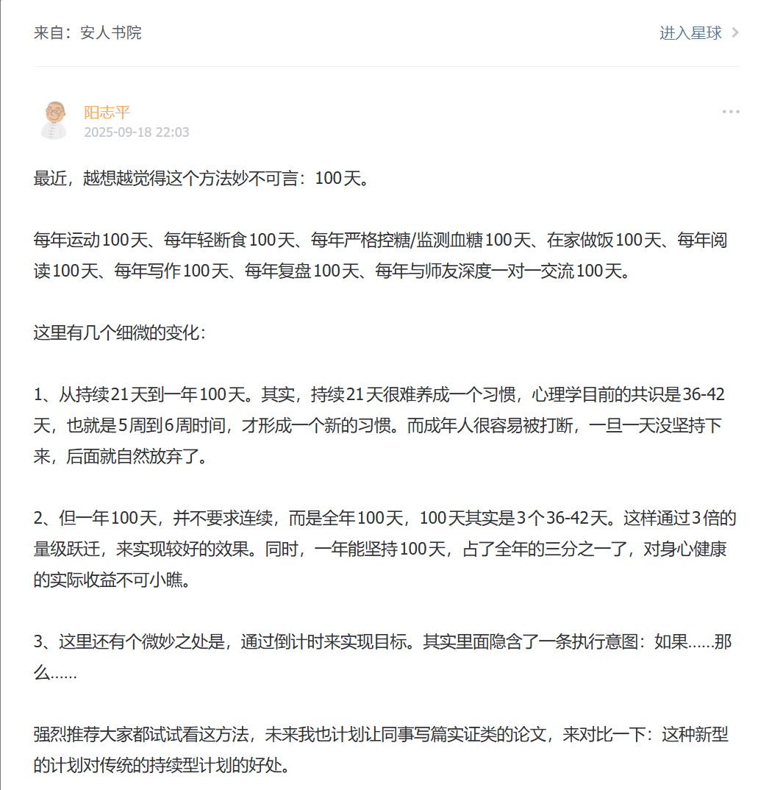

# 100打卡器 🎯

> 用科学方法培养习惯，100天非连续完成目标

<div align="center">


</div>

## 📖 项目简介

**100打卡器**是一个基于行动心理学的习惯养成工具，采用"100天法则"帮助用户在一年内以非连续方式完成目标。通过**年度配额法**和**执行意图（If-Then）**降低行动门槛，让习惯养成更轻松。

### ✨ 核心理念

- 📅 **非连续100天**：一年内完成100天即可，无需连续打卡
- 🎯 **执行意图**：使用"如果-那么"计划，自动触发行动
- 📊 **可视化追踪**：日历视图和统计数据，进度一目了然

---

## 🌟 功能特性

| 功能 | 说明 |
|------|------|
| **创建习惯** | 最多4个习惯，每个至少3个执行意图 |
| **每日打卡** | 选择执行的意图，每天只能打卡一次 |
| **日历视图** | 可视化显示本月打卡记录，绿色表示已完成 |
| **统计分析** | 查看进度、剩余天数、意图使用频率 |
| **多习惯管理** | Tab 切换不同习惯，独立追踪 |

---

## 🖥️ 技术栈

### 后端
- **FastAPI** - 高性能 Python Web 框架
- **Python 3.10+** - 标准库（json, datetime, uuid）

### 前端
- **Next.js 14** - React 框架（App Router）
- **TypeScript** - 类型安全
- **Tailwind CSS** - 现代化 UI 样式
- **date-fns** - 日期处理

### 数据存储
- **JSON 文件** - 轻量级本地存储

---

## 🚀 快速开始

### 前置要求

- Python 3.10+
- Node.js 18+
- npm 或 pnpm

### 1. 克隆项目

```bash
git clone https://github.com/your-username/100DK.git
cd 100DK
```

### 2. 启动后端

```bash
cd backend
pip install -r requirements.txt
python main.py
```

后端将在 `http://localhost:8000` 运行

### 3. 启动前端

```bash
cd frontend
npm install
npm run dev
```

前端将在 `http://localhost:3000` 运行

### 4. 开始使用

1. 打开浏览器访问 `http://localhost:3000`
2. 点击"创建第一个习惯"
3. 填写习惯名称和3个执行意图
4. 每天打卡并选择执行的意图

---


## 🎯 使用示例

### 创建习惯

```
习惯名称：每日运动

执行意图：
1. 如果「早上7:00闹钟响」→「立刻下楼快走20分钟」
2. 如果「下雨或雾霾」→「在家做15分钟自重训练」
3. 如果「起晚了」→「晚上8点补运动30分钟」
```

### 打卡流程

1. 点击"✅ 打卡"按钮
2. 选择今天实际执行的意图
3. 确认打卡，日历自动更新为绿色


## 📄 许可证

本项目采用 MIT 许可证 - 详见 [LICENSE](LICENSE) 文件

---

## 🙏 致谢

- 灵感来源：

-年度配额法  
  
（截图来自阳老师知识星球‘安人书院’，微信公众：心智工具箱）
- 执行意图理论：格尔维茨（Peter M Gollwitzer） 《行动心理学》（英文书目：Gollwitzer, P. M., & Bargh, J. A. (1995). The Psychology of Action. Guilford Press. ）
- woop方法：《WOOP 思维心理学》或称《反惰性》

---

<div align="center">

**⭐ 如果这个项目对你有帮助，请给一个 Star！**

Made with ❤️ by [Your Name]

</div>
